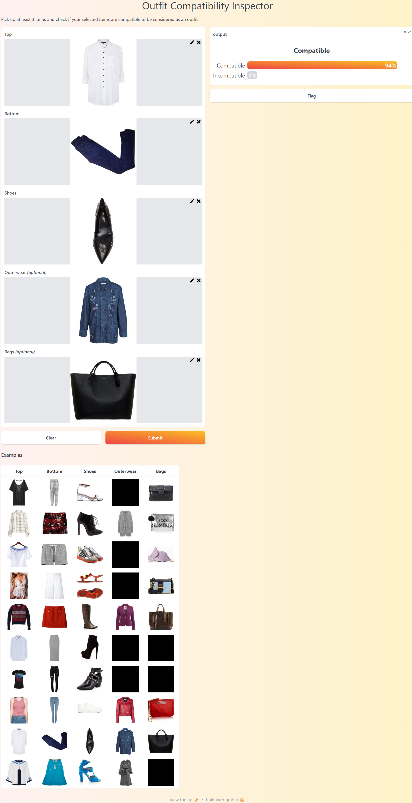

# Outfit Compatibility Prediction

* Predicts the compatibility rate of a set of clothes as a proper outfit.
* Plays a key role in the field of fashion recommendation systems or styling.
* Accomplished by the contribution of [Mohammed Al-Ani](https://github.com/MohammedAL-Ani).
* Developed using Python, TensorFlow, and Siamese Neural Network Architecture.
* Deployed by Gradio.

